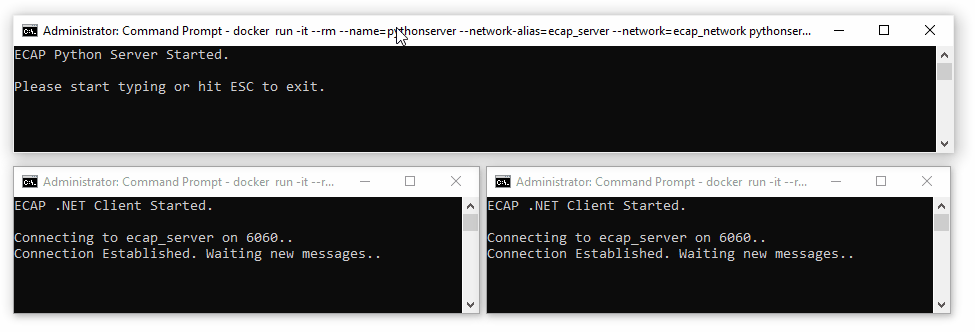

# ECAP
Hi there,

The following shot shows the server and multiple clients running:



To run them on your environment:

1. Open a CMD and clone the repository: 
```sh
git clone https://github.com/TheOtherAccount/ECAP.git
```

2. Create a network: 
```sh
docker network create ecap_network
```

3. Build an image for the server app: 
```sh
docker build -t pythonserver ECAP\PythonServer\
```

4. Build an image for the client app:
```sh
docker build -t dotnetclient ECAP\
```

5. Run the server attached to the current terminal:
```sh
docker run -it --rm --network-alias=ecap_server --network=ecap_network pythonserver
```

Now you have the server running but no clients yet; you can run as many clients as you want by using the following:

6. For each client app you want to run.. open a new CMD and then:
```sh
docker run -it --rm --network=ecap_network dotnetclient
```

Now when you go to the server and hit any printable key you should see it on all the running clients.